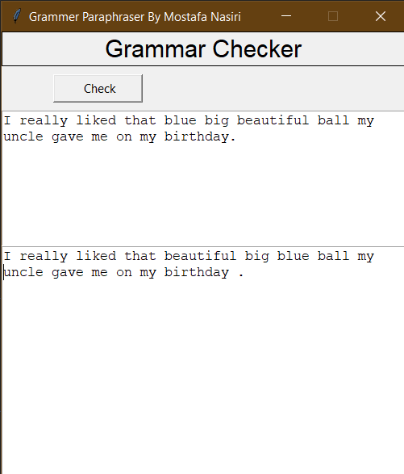

#  Grammar Checker & Paraphraser
This program is designed to check and detect and correct grammatical errors. My future plan is to add the ability to detect and correct content errors and the ability to summarize sentences.

**order of adjectives*

#  Requirements

This project is written in Python 3.8.5 and Shell scripts. However, to install and run the programs and scripts in this repository, you DO NOT need any requirements on your system except the following items.
* **Required packages**:
  * **TextBlob** (1.16.x or newer)
  * **Numpy** (1.23.x or above)
  * **Pandas** (1.4.x or above)
  * **nltk** (3.7 or above)
